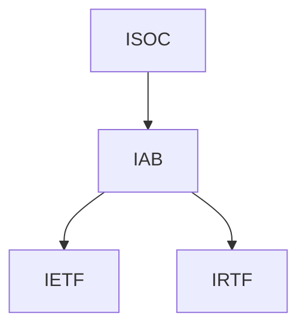

  

    Table of contents
  

  {: .text-delta }
1. TOC
{:toc}

# 1x00-概述

----

## 1x10 计算机网络在信息时代中的作用

计算机网络已经由一种通信基础设施发展成为一种重要的**信息服务**基础设施。

----

## 1x20 互联网概述

> 1x21 网络的网络做到理解，其他部分做到了解即可。

### 1x21 网络的网络

计算机网络有若干的**结点**(node)和连接这些结点的**链路**(link)组成。如下图所示，就是一个典型的具有四个节点，三条链路组成的网络。

通常情况下，我们可以使用一片云来表示一段网路，这样的好处是不需要关注网络内部的细节。

网络和网络之间还可以通过路由器相互连接起来，构造成一个更大的计算机网络。这样的网络成为**互连网**(internet)。因此互连网可以称为 **「网络的网络」**

**因特网**(Internet)是世界上最大的互连网络。

网络将许多计算机连接在一起，而互连网则将许多网络通过路由器连接在一起。

与网络相连的计算机通常成为主机。

> [internet 与 Internet](https://www.zhihu.com/question/21690010){: .btn }
>
> - internet : (互联网或互连网)是一个通用名词，泛指由多个计算机网络相互连接而成的网络。在这些网络之间的通信协议可以是任意的。
> - Internet : (因特网) 是一个专用名词，指代当前全球最大的、开放的、有众多网络所连接而成的特定计算机网络，采用 `TCP/IP` 协议簇作为通信的规则，前生是ARPANET。
> 

----

### 1x22 互连网基础结构发展的三个阶段

互联网主要经历了如下三个阶段

1. 从单个网络ARPANET想互联网发展
   1. 1969年，第一个分组交换网 ARPANET
   2. 1983年，TCP/IP 协议成为 ARPANET 的标准协议
2. 逐步建成三级结构因特网
   1. 1985年，建立 NSFNET (主干网、地区网和校园网)
   2. 1991年，主干网交由私人公司
3. 形成多层次 ISP 结构
   1. 1993年，由各个因特网 ISP 运营
   2. 1994年，万维网 WWW 技术促使互联网飞速发展
   3. 1995年，NSFNET停止，因特网彻底商业化。

**ISP(Internet Service Provider)** 通常可以从因特网中申请到一定的IP地址。

如下所示，是三层ISP的结构。不过由于现在的网络规模过大，三层已经很难描述如今的网络结构了。另外，如果一个用户接入因特网，那么这个人也可以成为一个 ISP。所以这个图仅仅是一个示意图。

----

### 1x23 因特网的标准化工作

因特网的标准化对如今的互联网非常重要。因特网在指定标准上的一个很大的特点是**面向公众**。并且所有的RFC(Request For Comments)计数文档都可以在因特网上免费下载到。

因特网的标准化成立了一个机构叫做**互联网协会ISOC**(Internet Society)。

ISOC 下有一个技术组织叫做**互联网体系结构委员会IBA**(Internet Architecture Board)，负责管理互联网有关的协议的开发。

IBA下又有两个工程部。

1. **互联网工程部IETF**(Internet Engineering Task Force)负责研究中短期问题，主要针对协议的开发和标准化。
2. **互联网研究部IRTF**(Internet Research Task Force)主要研究一些需要长期考虑的问题，包括互联网的一些协议、应用、体系结构等。

层次如下

制定因特网的正式标准需要经过下述3个阶段
1. 因特网草案 (不能算是RFC文档)
2. 建议标准 (开始成为RFC文档)
3. 因特网标准 (达到正式标准后，分配编号SID xx)

----

## 1x30 互联网的组成

互联网主要包括下述两个部分

1. **边缘部分**
   1. 有所有连接在互联网上的主机组成
   2. 是用户**直接使用**的
   3. 用来通信和资源共享
2. **核心部分**   
   1. 由大量网络和连接这些网络的路由器组成
   2. 主要为**边缘部分提供服务**的

----

### 1x31 互联网的边缘部分

处在互联网边缘的部分是连接在互联网上所有的主机。成为端系统(end system)。

通常来说，两台电脑通信可以简单的理解为『主机A上的某个进程和主机B上的某个进程进行通信』。将这种说法称为 **「计算机间的通信」**。

通常通信主要有两种
1. 客户-服务端(C/S) 
2. 对等(P2P)

----

#### 1 客户服务器方式

通常一个程序可能涉及到两个地方的通信一个是 **客户**(client) 和 **服务器**(server)

通常来说，***客户是服务的请求方，服务器是服务的提供方***。

通常来说，他们分别有如下的特点。

客户程序
1. 被用户调用后运行，同时向服务器请求服务。因此，客户程序必须知道服务程序的地址
2. 不需要特殊的硬件和操作系统

服务程序
1. 专门用来提供某种服务的程序，可以**同时处理**多个请求
2. 启动后不断的运行这，等待请求。因此服务程序不需要知道客户程序的地址。
3. 一般需要强大的硬件和高级的操作系统支持。

但是，他们一旦建立连接后通信就可以是双向的了。

----

#### 2 对等连接的方式

**对等连接**(peer-to-peer) 也被称为 P2P。

对等连接的意思非常容易明白。一天电脑既可以成为客户端，也可以成为服务端，当一个资源共享量非常大的时候，那么这个时候这种连接方式得到的速度提升是非常大的。

### 1x32 互联网的核心部分

网络核心是互联网中最复杂的部分。

在网络核心中起特殊作用的是**路由器**(router)，路由器实现了**分组交换**(packet switching)的关键功能。

其中三种交换方式分别由如下三种:

1. 电路交换
2. 分组交换
3. 报文交换

----
#### 1 电路交换

电路交换起初是用在电话上的，这个电路通常是两两连接的。因此，当有 $n$ 个电话的时候，这个时候就有 $\frac{n(n-1)}{2}$ 对电线。这是十分庞大的。

在如今通常采用交换机将这些电话互相连接起来。

从通信的角度来看，**交换** (switching)就是按照某种方式动态的分配传输线路的资源。

电路交换通常需要以下的三个步骤。

1. 建立连接 (分配通信资源)
2. 通话 (一直占用资源)
3. 释放连接 (归还通信资源)

----

#### 2 分组交换

一段信息通常会被分成多条信息

