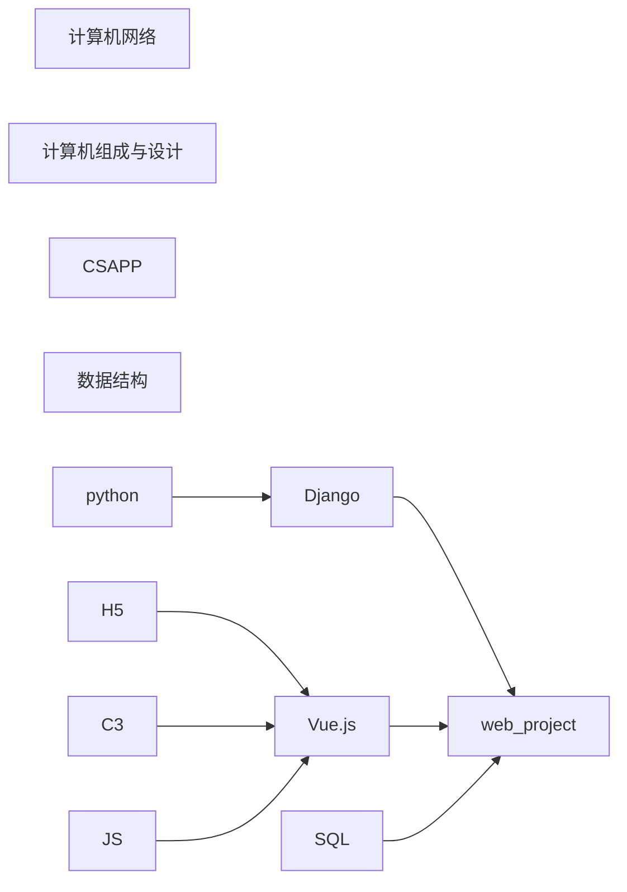

# Welcome

这个站点将留存我的学习笔记。

[<i class="fa-solid fa-draw-polygon"></i>markup.js - 思维导图](https://markmap.js.org/){: .btn }

如果需要思维导图的话，请点击上面的连接，并且点击 `Try it out`.

然后在需要的文章底部，点 `Edit this page on GitHub`.

最后将文章复制进去即可。

<https://real-king-ph.github.io/rkNote>

## Recently Plan

> 该内容长期处于变动中，在一段时间内不变  
> 越是在上面优先级越高
>
> 目前由于加入 [OScamp](https://github.com/LearningOS/rust-based-os-comp2022) 比较倾向于 OS
>   

近期动态请看 [notion](https://real-king.notion.site/2022-Summer-List-54acfddea22d4e1896361aae134cab13)(06.29后将有具体的计划)

万丈高楼平地起，勿在浮沙筑高台。我所在的学校，只能算较差等次的211，既然学校的课程，陷入了不可避免的「[放宽](https://www.zhihu.com/question/507373378)」。自学就是接下来无法避免的事情了，越是在上面优先级越高。

| Course Name                      | status |
| -------------------------------- | ------ |
| [计算机网络微课堂][bilibili_net] | 14/73  |
| [COA][coa]                       | 0      |
| C++ Primer                       |        |
| [CSAPP][csapp]                   | 0      |
| [NJU OS][nju_os]                 | 2/32   |
| [CS144][cs144]                   | 0      |

[bilibili_net]: https://www.bilibili.com/video/BV1c4411d7jb?share_source=copy_web "一个通俗易懂的课堂"
[nju_os]: http://jyywiki.cn/OS/2022/ "落到实处的操作系统教学"
[cs144]: https://csdiy.wiki/%E8%AE%A1%E7%AE%97%E6%9C%BA%E7%BD%91%E7%BB%9C/CS144/ "手把手的计算机网络编写"
[csapp]: https://csdiy.wiki/%E4%BD%93%E7%B3%BB%E7%BB%93%E6%9E%84/CSAPP/ "计算机体系结构"
[coa]: https://www.bilibili.com/video/BV1tz411z7GN "基于RISC-V的组成原理"