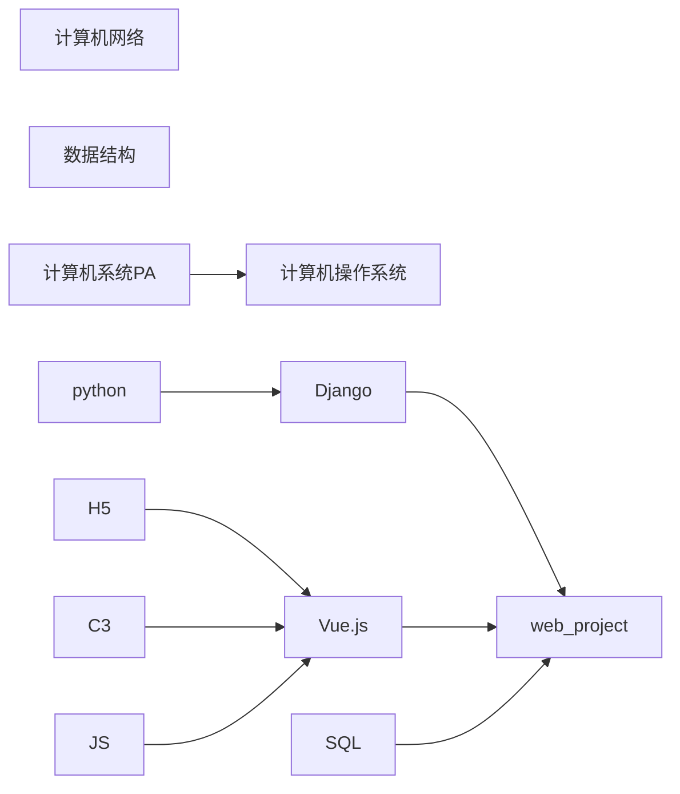

# Welcome

这个站点将留存我的学习笔记。

<https://real-king-ph.github.io/rkNote>

## MyRoad Map

1. 计算机网络详见笔记
2. 部分高级数据结构
3. 计算机系统与操作系统学习南大的[课程](http://jyywiki.cn/)
4. 计算机系统只完成PA部分(因为本校的实验课太拉！)
5. Python 看看书，复习一遍
6. Django 看文档
7. H5 C3 JS 看网络教程+实战
8. Vue 看文档
9. web_project 看文档+部分网络教材与实战。
10. SQL 看书+实战

近期动态请看 [notion](https://real-king.notion.site/2022-Summer-List-54acfddea22d4e1896361aae134cab13)(06.29后将有具体的计划)

