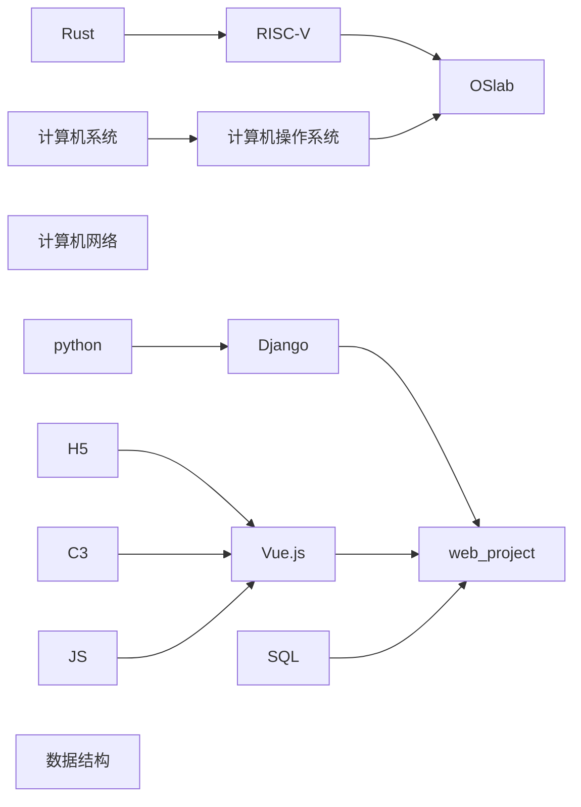

# Welcome

这个站点将留存我的学习笔记。

[<i class="fa-solid fa-draw-polygon"></i>markup.js - 思维导图](https://markmap.js.org/){: .btn }

如果需要思维导图的话，请点击上面的连接，并且点击 `Try it out`.

然后在需要的文章底部，点 `Edit this page on GitHub`.

最后将文章复制进去即可。

<https://real-king-ph.github.io/rkNote>

## Recently Plan

> 该内容长期处于变动中，在一段时间内不变  
> 越是在上面优先级越高
>
> 目前由于加入 [OScamp](https://github.com/LearningOS/rust-based-os-comp2022) 比较倾向于 OS
>   

近期动态请看 [notion](https://real-king.notion.site/2022-Summer-List-54acfddea22d4e1896361aae134cab13)(06.29后将有具体的计划)

